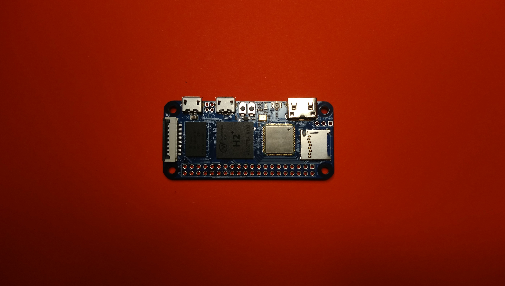

# Mesh Box
Documentation and Files for building a Mesh Network Node based on a Banana Pi Zero and Reticulum Stack

## Required Hardware
- Banana Pi Zero
<p align="center" width="100%">
  
  
</p>

- ESP32 based LoRa T3 module
<p align="center" width="100%">
  
  
</p>

- Optional: Battery module
<p align="center" width="100%">
  
  
</p>

- Cables & Connectors
- WIFI Antenna for Banana Pi Zero

<p align="left" width="100%">
  
</p>

## Hardware setup

### Connect to bPi Serial Debug Interface
<p align="center" width="100%">
  
  
</p>
<p align="center" width="100%">
  
  
  
</p>

### Connect bPi with ESP32

<p align="center" width="100%">
  
  
  
</p>

### Connect with Power Source

<p align="center" width="100%">
  
  
</p>


## Software Setup

- Download Armbian image and checksum
  `wget https://stpete-mirror.armbian.com/archive/bananapim2zero/archive/Armbian_21.08.1_Bananapim2zero_hirsute_edge_5.13.12.img.xz`
  `wget https://stpete-mirror.armbian.com/archive/bananapim2zero/archive/Armbian_21.08.1_Bananapim2zero_hirsute_edge_5.13.12.img.xz.asc`

- Verify checksum
  `sha256sum -c Armbian_21.08.1_Bananapim2zero_hirsute_edge_5.13.12.img.xz.sha`
  Output should be:
  `Armbian_21.08.1_Bananapim2zero_hirsute_edge_5.13.12.img.xz: OK`

- Extract archive
  `xz -d Armbian_21.08.1_Bananapim2zero_hirsute_edge_5.13.12.img.xz`

- Transfer image to microSD card
  - insert micro SDcard
  - check `dmesg` output for new device
    ```
    [454114.809037] ums-realtek 1-3:1.0: USB Mass Storage device detected
    [454114.821987] scsi host6: usb-storage 1-3:1.0
    [454114.822121] usbcore: registered new interface driver ums-realtek
    [454115.853806] scsi 6:0:0:0: Direct-Access     Generic- SD/MMC/MS PRO    1.00 PQ: 0 ANSI: 4
    [454115.854150] sd 6:0:0:0: Attached scsi generic sg1 type 0
    [454115.856826] sd 6:0:0:0: [sda] 62333952 512-byte logical blocks: (31.9 GB/29.7 GiB)
    ```
   - write image to microSD card
     `sudo dd if=Armbian_21.08.1_Bananapim2zero_hirsute_edge_5.13.12.img of=/dev/sda bs=4096k status=progress`

### Image Setup

- Insert microSD card into the bPi
- Connect the bPi serial debug interface with the serial<->usb adapter to yout computer
- Open a connection
  - check `dmesg` output for new device
    ```
    [456060.557945] usbserial: USB Serial support registered for FTDI USB Serial Device
    [456060.557967] ftdi_sio 1-3:1.0: FTDI USB Serial Device converter detected
    [456060.557997] usb 1-3: Detected FT232RL
    [456060.565508] usb 1-3: FTDI USB Serial Device converter now attached to ttyUSB0
    ```
  - connect to device
    `screen /dev/ttyUSB0 115200`
    Your screen terminal will stay blank. This is normal, leave it running
  - bootup bPi by pluging in microUSB power source
  - wait for the bootup messages finish
- Once the initial login program starts, enter password and create user as guided

### Configure Wifi

- Connect the wifi antenna with the bPi
- run `nmtui` and use its UI to choose you network and provide credentials

<p align="center" width="100%">
  
  
</p>

- Show ip adress
  `ip a l wlan0 | awk '/inet/ {print $2}'`

### System Setup

- Login to the bPi using ssh
- Update system
  `apt-get update && apt-get upgrade`
- Run `armbian-config` and configure
  - System->CPU
	Minimum Speed: 480000
    Maximum Speed: 480000
    Governor: powersave
  - System->Hardware
	Enable: uart3
    

### Required Software

### Python Modules

### Reticulum

### Access Point


## Casing

### With Battery

### Without Battery
