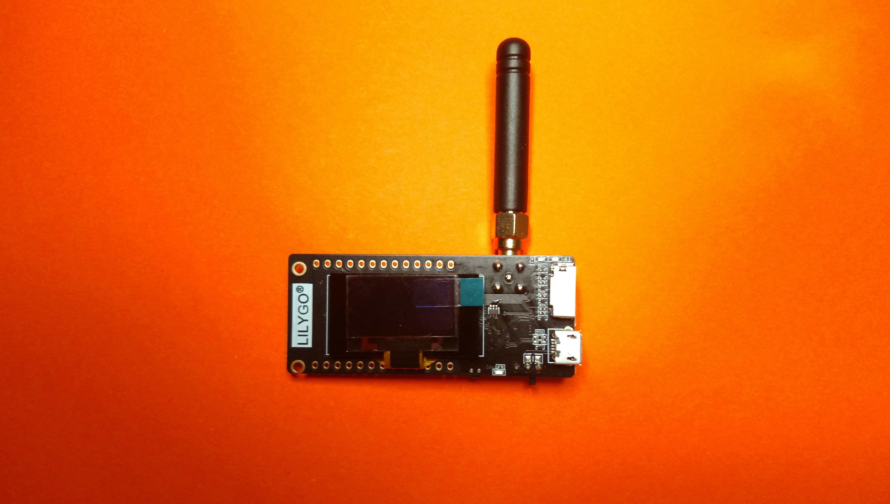

# Mesh Box
Documentation and Files for building a Mesh Network Node based on a Banana Pi Zero and Reticulum Stack

## Required Hardware
- Banana Pi Zero

  
  

- ESP32 based LoRa T3 module

  
  

- Optional: Battery module

  
  

- Cables & Connectors
- WIFI Antenna for Banana Pi Zero

  

## Hardware setup

### Connect to bPi Serial Debug Interface

  
  

  
  
  

### Connect bPi with ESP32

  
  
  

### Connect with Power Source

  
  

## Software Setup

### Image Setup

### Required Software

### Python Modules

### Reticulum

### Access Point

## Casing

### With Battery

### Without Battery
